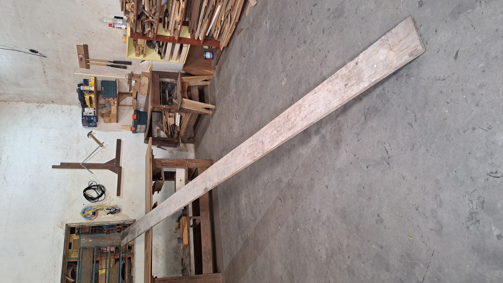
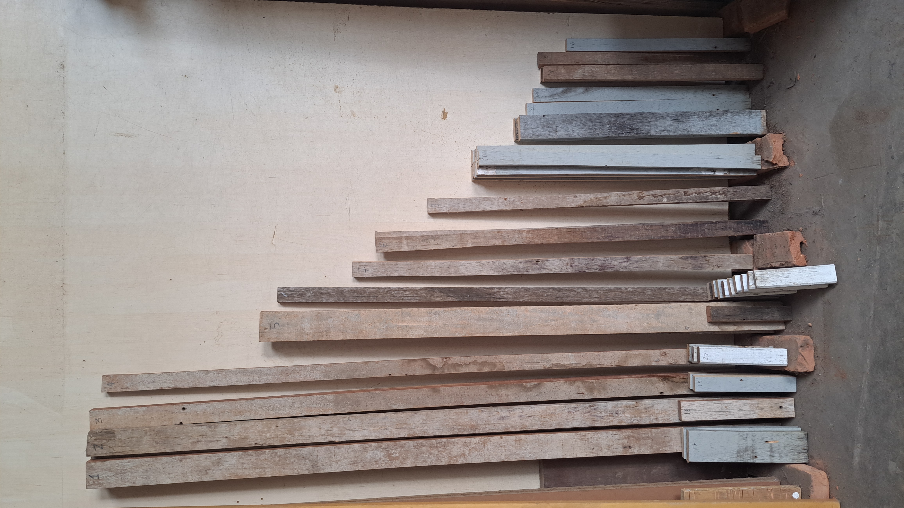
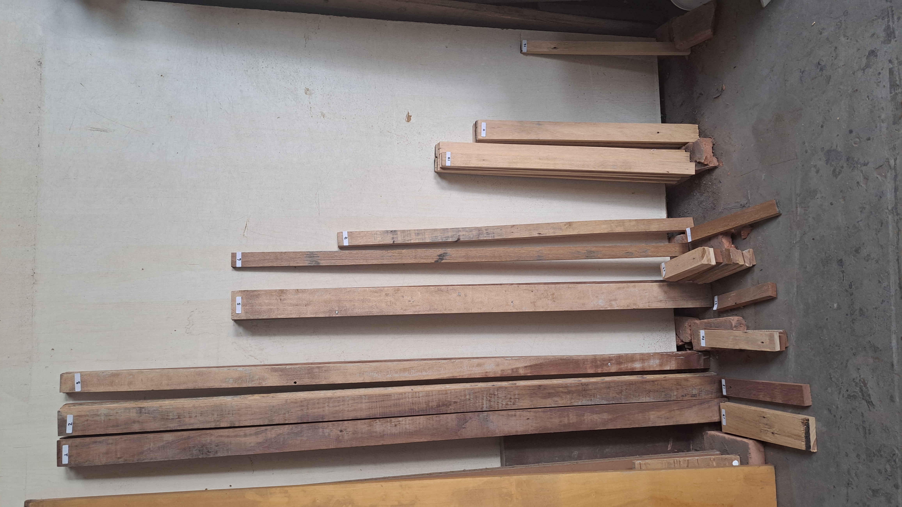
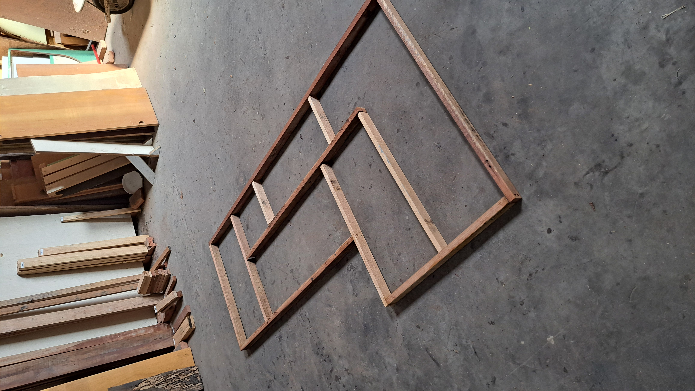
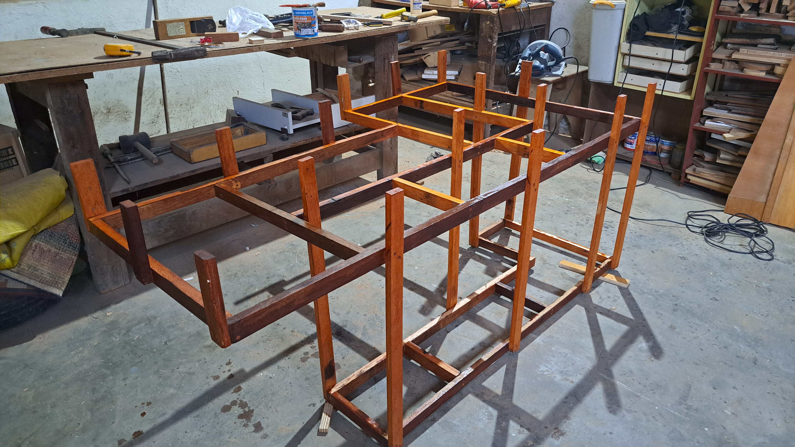

# 🪚 Projetos de Marcenaria 

Bem-vindo ao repositório de **projetos de marcenaria**! Aqui você encontrará uma coleção de projetos para criar móveis e peças de madeira, com arquivos `.dwg` prontos para uso em máquinas de corte CNC ou para impressão técnica.

> **Sustentabilidade em foco**: Todos os projetos foram criados utilizando madeiras de construção ou madeiras recicladas, promovendo o reaproveitamento de materiais e contribuindo para um mundo mais sustentável. 🌱

---

## ✨ O que você encontrará aqui?

- **Modelos de projetos**: Estruturas detalhadas com dimensões e cortes otimizados.
- **Arquivos `.dwg`**: Desenhos técnicos prontos para uso.
- **Instruções de montagem**: Passo a passo detalhado para facilitar a construção.

---

## 🛠 Como os projetos foram feitos?

As madeiras utilizadas na maioria dos projetos são provenientes de reuso, promovendo a reutilização de materiais.

### **Materiais**
- Madeiras de construção ou recicladas, reaproveitando sobras de outras obras ou móveis descartados.
- Fixação com **cola Titebond 2** e parafusos.
- Acabamentos com:
  - **Brocas escareadoras** para parafusos invisíveis.
  - **Cavilhas** para um design mais limpo.
  - **Seladores**, **vernizes** e **Polisten** para proteger e realçar o visual da madeira.

### **Equipamentos utilizados**
- **Máquinas elétricas**:
  - Serra circular.
  - Serra tico-tico.
  - Plaina elétrica.
  - Lixadeira.
  - Furadeiras/parafusadeiras.
- **Ferramentas manuais**:
  - Trena, paquímetro, esquadro, grampos de fixação e formões.

Essas ferramentas permitiram criar projetos funcionais e esteticamente agradáveis, com alta durabilidade e aproveitamento máximo da madeira.

---

## O Processo Produtivo  

O processo de fabricação foi documentado em fotos para ilustrar cada etapa, conforme descrito abaixo:  

1. **Seleção da Madeira**  
   A madeira foi escolhida de acordo com a aplicação do projeto, considerando o ambiente (interno ou externo) e os níveis de umidade tolerados.  
   

     
   

2. **Corte**  
   As peças foram cortadas conforme as especificações do projeto, utilizando ferramentas como serra circular e serra tico-tico.  
   

     
   

3. **Preparo**  
   - As peças passaram pela plaina elétrica para nivelamento.  
   - O lixamento garantiu superfícies suaves e seguras.  
   - As peças foram identificadas para organização na montagem.  
   

     
   

4. **Montagem**  
   Na montagem, utilizamos cola Titebond 2 e parafusos adequados para garantir resistência estrutural e durabilidade.  
   

     
   

5. **Acabamento**  
   Finalizamos o projeto com aplicação de seladores, vernizes ou Polisten, realçando o visual e protegendo a madeira.  
   

     
   

---

### Detalhes dos Projetos

Detalhes completos, incluindo as instruções de montagem e os arquivos `.dwg` podem ser encontrados nos respectivos arquivos de cada projeto.
