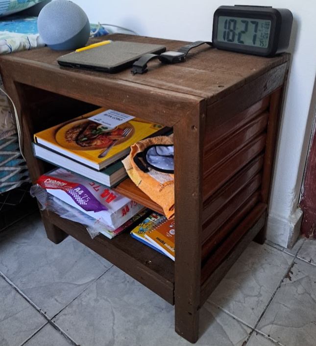

# 🪚 Criado Mudo

Este criado mudo foi projetado para ser simples, mas elegante, com compartimentos para armazenamento. O design é baseado na funcionalidade, permitindo um fácil acesso a itens essenciais como celular, livro, ou relógio.

---

## ✨ Descrição do Projeto

Este criado mudo foi projetado para ser simples, mas elegante, com compartimentos para armazenamento. O design é baseado na funcionalidade, permitindo um fácil acesso a itens essenciais como celular, livro, ou relógio.

### **Materiais**:
- Madeira de construção reciclada.
- Parafusos de aço inox.
- Cola Titebond 2 para maior resistência.
- Verniz e Polisten de Imbuia

---

## 🛠 Projeto AutoCAD

Confira abaixo o projeto feito no AutoCAD

 **Projeto**
   

     
   

---

## 🖼 Resultado Final

Aqui está o resultado final do **Criado Mudo**, pronto para ser utilizado.

  

