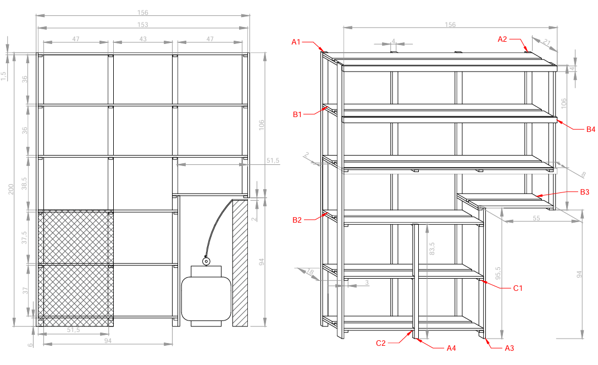
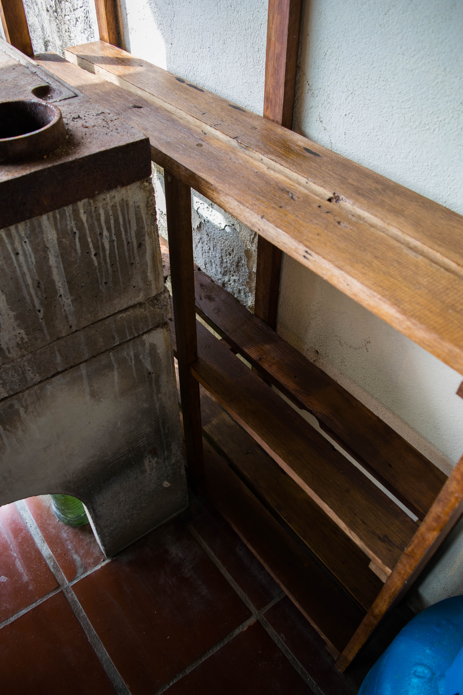
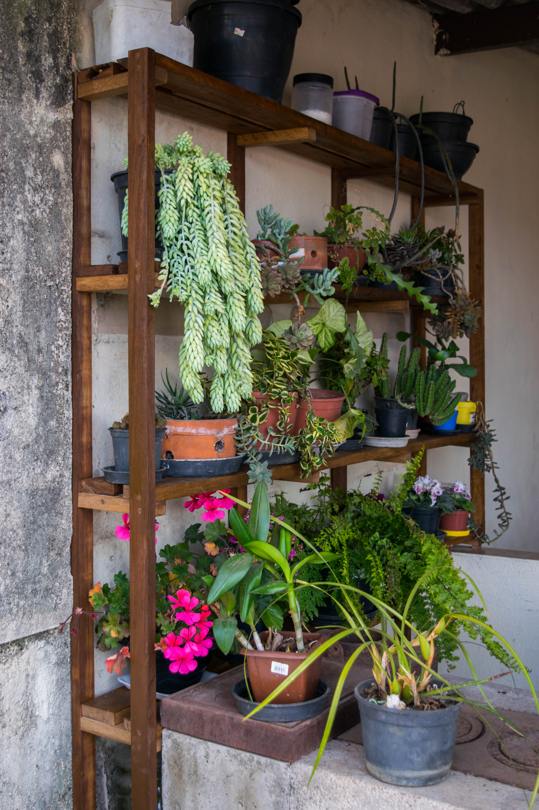

# 🪑 Estante Churrasqueira

Esta estante churrasqueira foi projetada para combinar praticidade e estilo, com prateleiras amplas para armazenamento e uma área dedicada ao preparo e organização do churrasco. O design foi planejado de modo que se encaixasse perfeitamente na área de serviços.

---

## ✨ Materiais

- Madeira de construção reciclada.
- Parafusos de aço inox.
- Cola Titebond 2 para maior resistência.
- Polisten de Imbuia para acabamento e proteção.

---

## 🛠 Projeto AutoCAD

Confira abaixo o projeto feito no AutoCAD

**Projeto**

  

---

## 🖼 Resultado Final

Aqui está o resultado final da **Estante Churrasqueira**, pronta para ser utilizada.

  

  

  

