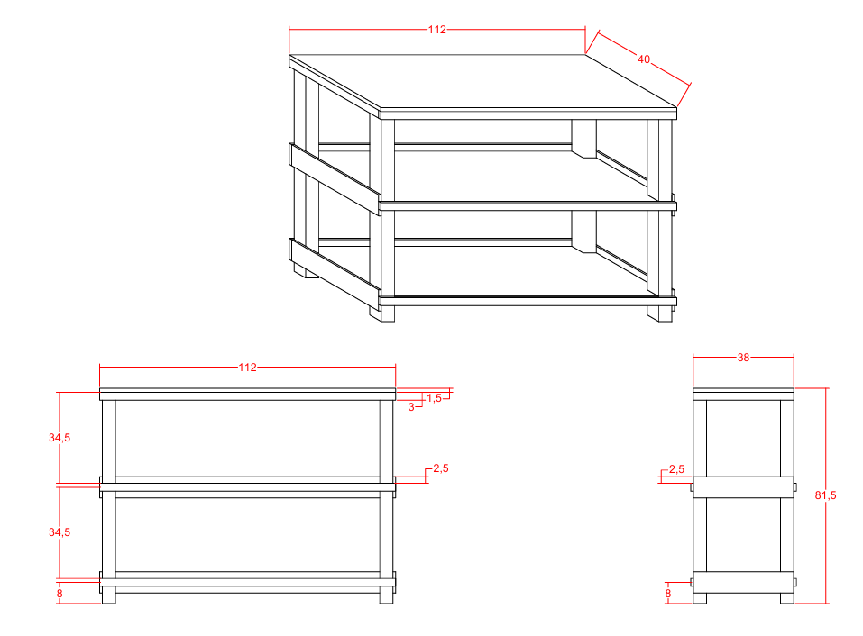
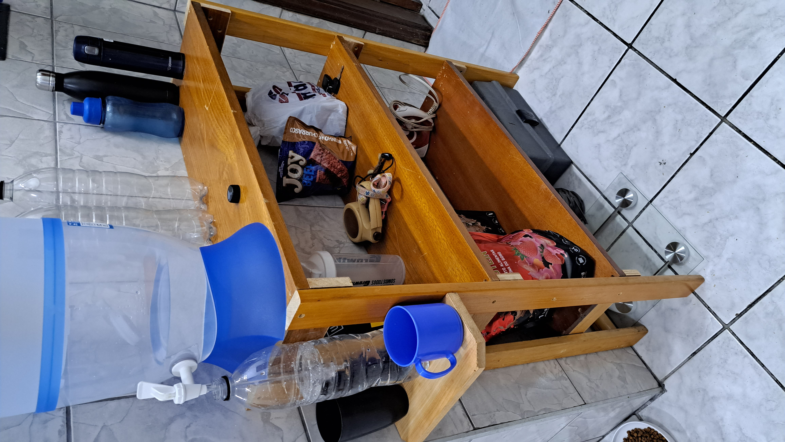

# 🪑 Estante Cozinha

Esta estante cozinha foi projetada para otimizar o armazenamento e a organização de utensílios de cozinha, com prateleiras amplas e espaços dedicados para itens essenciais. O design foi pensado para proporcionar praticidade e facilitar o acesso aos itens mais utilizados na cozinha.

---

## ✨ Materiais

- Madeira de móveis usados.
- Parafusos de aço inox.
- Cola Titebond 2 para maior resistência.
- Verniz para acabamento e proteção.

---

## 🛠 Projeto AutoCAD

Confira abaixo o projeto feito no AutoCAD

**Projeto**

  

---

## 🖼 Resultado Final

Aqui está o resultado final da **Estante Cozinha**, pronta para ser utilizada.

  

