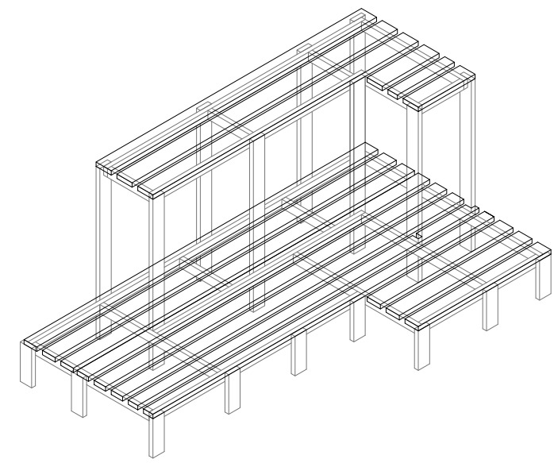
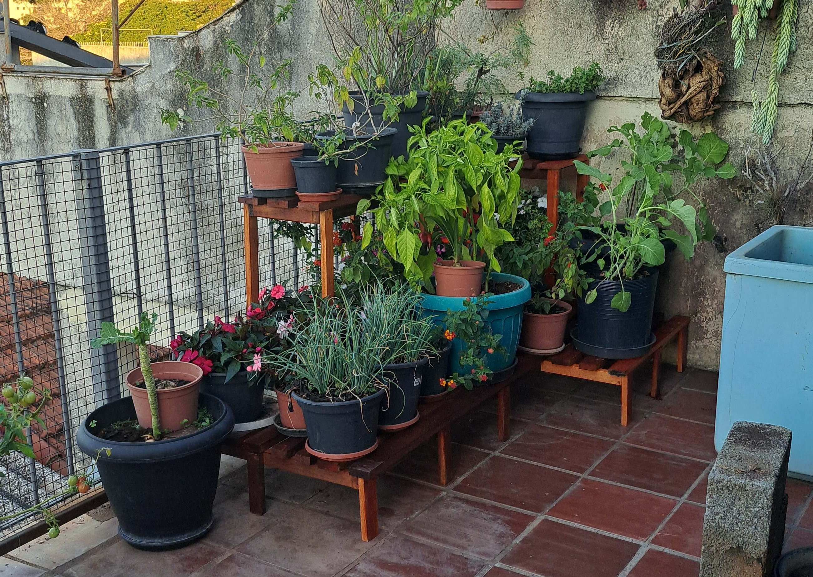

# 🪑 Estante Flores

Esta estante flores foi projetada para proporcionar um espaço dedicado ao armazenamento e exposição de plantas e vasos. Com prateleiras espaçosas e um design elegante, ela foi pensada para otimizar a organização e destacar a beleza das plantas, tornando o ambiente mais agradável e funcional.

---

## ✨ Materiais

- Madeira de construção reciclada.
- Parafusos de aço inox.
- Cola Titebond 2 para maior resistência e resistência a umidade.
- Polisten para acabamento e proteção.

---

## 🛠 Projeto AutoCAD

Confira abaixo o projeto feito no AutoCAD

**Projeto**

  

---

## 🖼 Resultado Final

Aqui está o resultado final da **Estante Flores**, pronta para ser utilizada.

  

  

  

