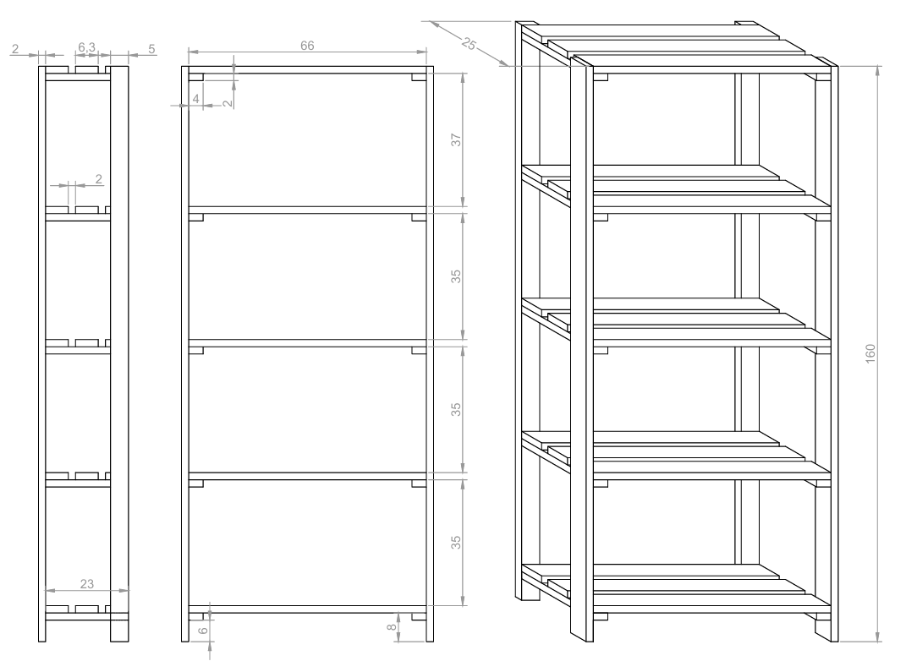
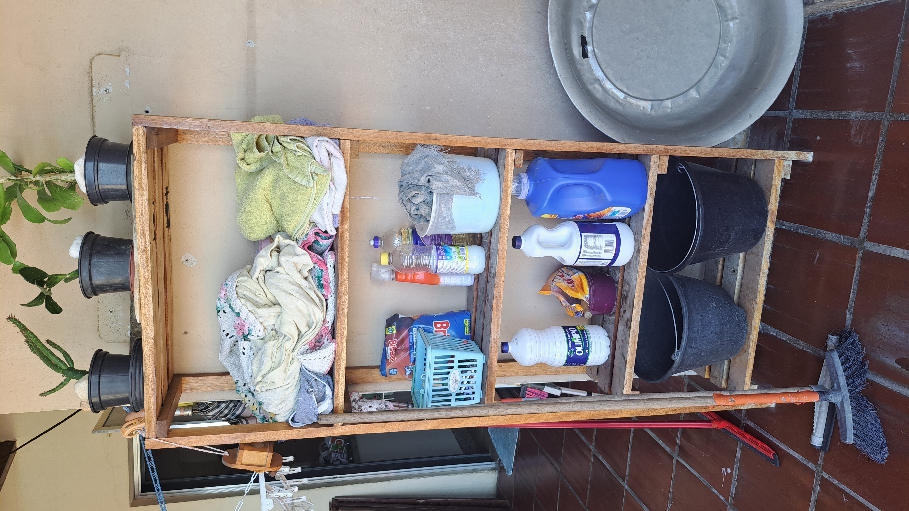

# 🪑 Estante Lavanderia

Esta estante lavanderia foi projetada para otimizar o armazenamento de produtos de limpeza e utensílios da lavanderia. Com prateleiras amplas e um design prático, ela oferece organização e facilita o acesso aos itens essenciais, tornando o ambiente mais funcional e arrumado.

---

## ✨ Materiais

- Madeira de construção reciclada.
- Parafusos de aço inox.
- Cola Titebond 2 para maior resistência e resistência a umidade.
- Verniz para acabamento e proteção.

---

## 🛠 Projeto AutoCAD

Confira abaixo o projeto feito no AutoCAD

**Projeto**

  

---

## 🖼 Resultado Final

Aqui está o resultado final da **Estante Lavanderia**, pronta para ser utilizada.

  

