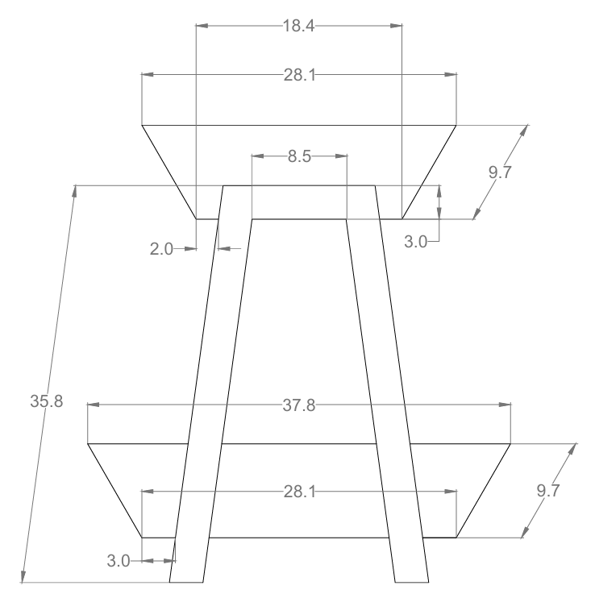

# 🪑 Fruteira

Esta fruteira foi projetada para oferecer uma maneira prática e organizada de armazenar frutas, destacando sua beleza e facilitando o acesso aos itens. Com prateleiras espaçadas e um design simples, ela é ideal para deixar a cozinha mais charmosa e funcional.

---

## ✨ Materiais

- Madeira reciclada.
- Pregos e parafusos de aço inox.
- Cola Titebond 2 para maior resistência.
- Verniz para acabamento e proteção.

---

## 🛠 Projeto AutoCAD

Confira abaixo o projeto feito no AutoCAD

**Projeto**

  

---

## 🖼 Resultado Final

Aqui está o resultado final da **Fruteira**, pronta para ser utilizada.

  

