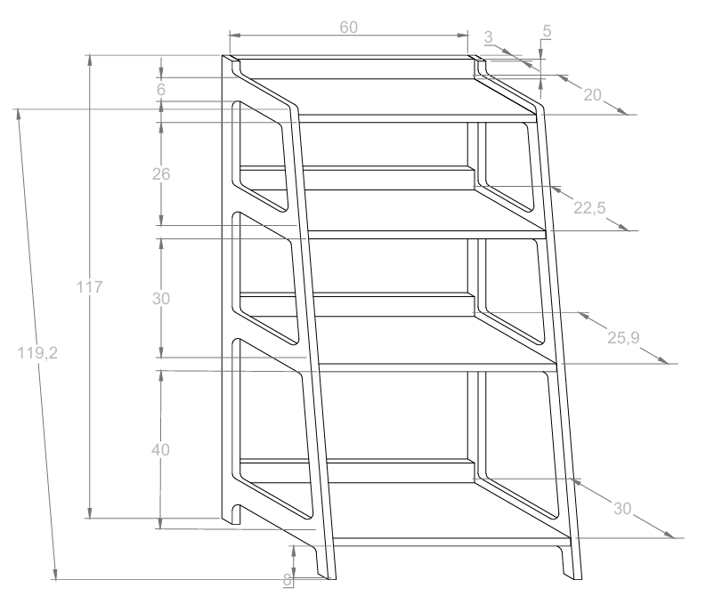
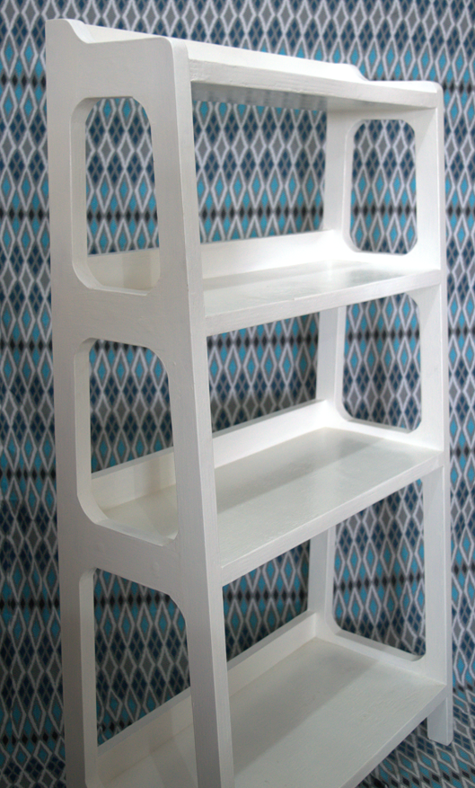

# 🪑 Mostruário

Este mostruário foi projetado para exibir produtos de forma organizada e atrativa. Com prateleiras ajustáveis e um design moderno, ele permite a melhor visualização dos itens, destacando sua beleza e tornando o ambiente mais funcional e elegante.

---

## ✨ Materiais

- Madeira de construção reciclada.
- Parafusos de aço inox.
- Cola Titebond 2 para maior resistência.
- Esmalte brilhante branco.

---

## 🛠 Projeto AutoCAD

Confira abaixo o projeto feito no AutoCAD

**Projeto**

  

---

## 🖼 Resultado Final

Aqui está o resultado final do **Mostruário**, pronto para ser utilizado.

  

