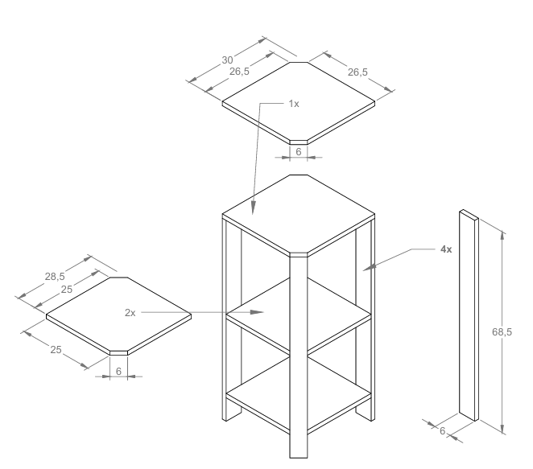

# 🪑 Suporte Cafeteira

Este suporte cafeteira foi projetado para organizar e facilitar o uso da cafeteira na cozinha. Com um design simples e funcional, ele proporciona espaço para armazenar a cafeteira de forma prática e segura, deixando o ambiente mais arrumado e eficiente.

---

## ✨ Materiais

- Madeira de construção reciclada.
- Parafusos de aço inox.
- Cola Titebond 2 para maior resistência.
- Polisten para acabamento e proteção.

---

## 🛠 Projeto AutoCAD

Confira abaixo o projeto feito no AutoCAD

**Projeto**

  

---

## 🖼 Resultado Final

Aqui está o resultado final do **Suporte Cafeteira**, pronto para ser utilizado.

  

