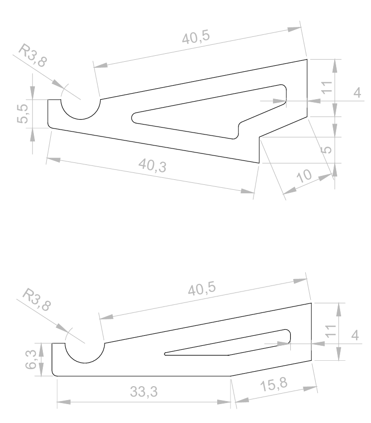
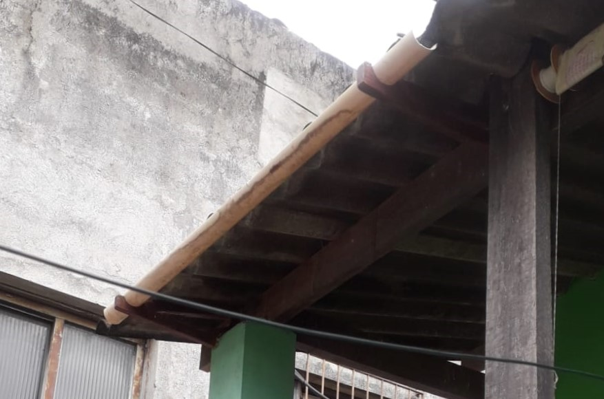

# 🪑 Suporte Calha

Este suporte de calha foi desenvolvido para sustentar um cano de PVC, substituindo temporariamente a calha danificada pelo alto volume de chuvas. Com um design robusto e eficiente, ele assegura a fixação segura das calhas e facilita o escoamento da água de maneira prática, mantendo o ambiente limpo e funcional.

---

## ✨ Materiais

- Madeira de construção reciclada.
- Verniz para acabamento e proteção.

---

## 🛠 Projeto AutoCAD

Confira abaixo o projeto feito no AutoCAD

**Projeto**

  

---

## 🖼 Resultado Final

Aqui está o resultado final do **Suporte Calha**, pronto para ser utilizado.

  

