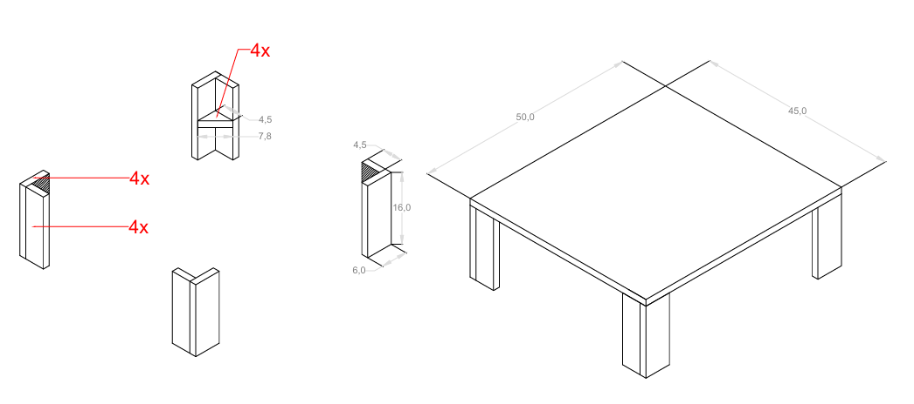
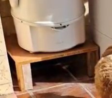

# 🪑 Suporte Centrífuga

Este suporte centrífuga foi projetado para fornecer uma base estável e prática para a centrífuga, facilitando o uso e a organização na cozinha. Com um design funcional e resistente, ele permite armazenar o aparelho de maneira segura, otimizando o espaço e garantindo o reuso da água por meio de sua base alta.

---

## ✨ Materiais

- Madeira de construção reciclada.
- Parafusos de aço inox.
- Cola Titebond 2 para maior resistência.

---

## 🛠 Projeto AutoCAD

Confira abaixo o projeto feito no AutoCAD

**Projeto**

  

---

## 🖼 Resultado Final

Aqui está o resultado final do **Suporte Centrífuga**, pronto para ser utilizado.

  

