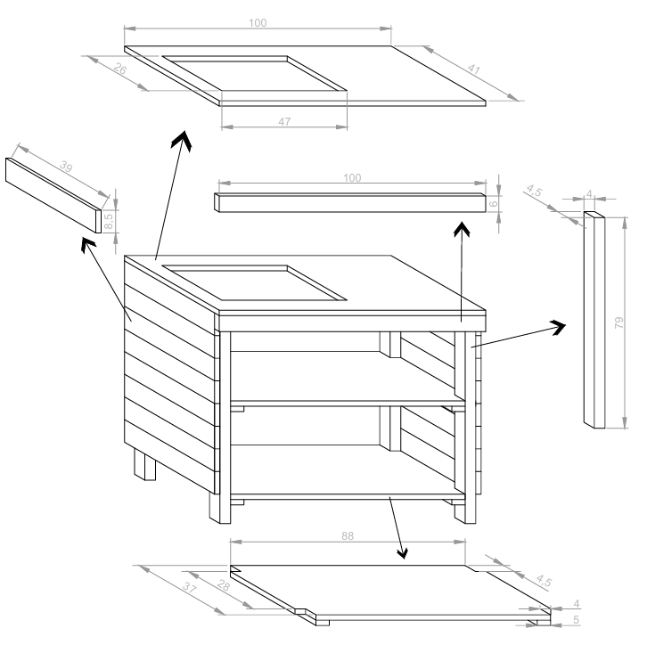

# 🪑 Suporte Cooktop

Este suporte cooktop foi projetado para oferecer estabilidade e praticidade ao armazenar e organizar o cooktop na cozinha. Seu design robusto e funcional proporciona um suporte seguro e otimiza o espaço, tornando a cozinha mais eficiente e organizada.

---

## ✨ Materiais

- Madeira de construção reciclada.
- Parafusos de aço inox.
- Cola Titebond 2 para maior resistência.
- Verniz para acabamento e proteção.

---

## 🛠 Projeto AutoCAD

Confira abaixo o projeto feito no AutoCAD

**Projeto**

  

---

## 🖼 Resultado Final

Aqui está o resultado final do **Suporte Cooktop**, pronto para ser utilizado.

  

