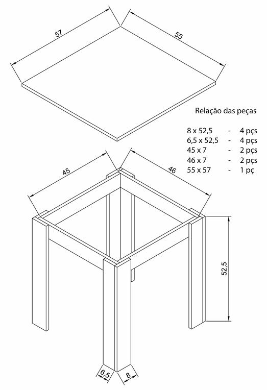

# 🪑 Suporte Frigobar

Este suporte frigobar foi projetado para oferecer suporte estável e seguro para o frigobar, facilitando o uso e otimizando o espaço na cozinha ou em outros ambientes. Com um design robusto e funcional, ele garante a organização e durabilidade do aparelho.

---

## ✨ Materiais

- Madeira de construção reciclada.
- Parafusos de aço inox.
- Cola Titebond 2 para maior resistência.

---

## 🛠 Projeto AutoCAD

Confira abaixo o projeto feito no AutoCAD

**Projeto**

  

---

## 🖼 Resultado Final

Aqui está o resultado final do **Suporte Frigobar**, pronto para ser utilizado.

  

